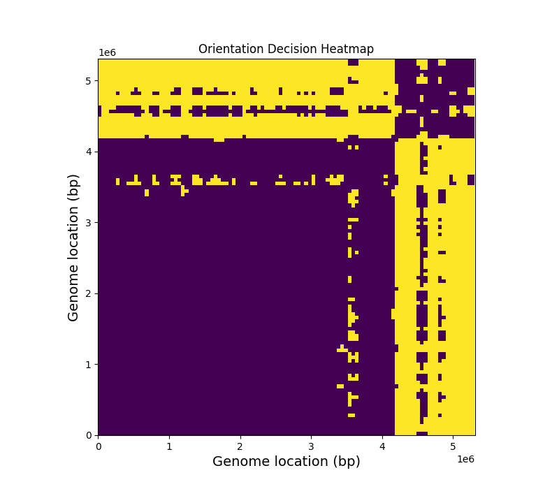
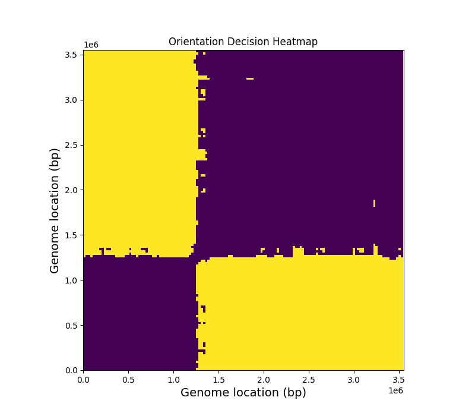
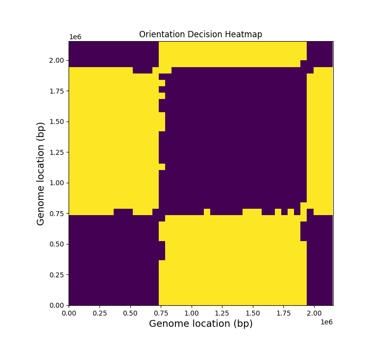

Oriented TNF
============

This project uses the *oriented* TNF to detect and analyze inversions in bacterial genomes. The orientation matrix is the pairwise orientations between small windows evenly spaced along the genome. A simple spectral clustering method is used to find inversions in the matrix. 

Available features (all ran by default):

1) Compute and plot Orientation Matrix heatmap.

2) Locate inversions in the input genome. If only one large inversion exists, it corresponds to the Origin/Terminus replication sites.

3) Detect and correct an inverted misassembly.

Requirements
-------------

- Python 3.5+
- MUMmer 3 or MUMmer 4

Check **requirements.txt** for python package requirements or run 

``python3 -m pip install -r requirements.txt``

Run code
------------

Must be run in the Oriented-TNF directory! Description of inputs and options can be found using
    
``python3 detect.py -h``

Note that the path to the nucmer executable must be supplied (with ``--nucmer``) if not in PATH.

Example 1: *E. coli* genome
---------------

.. code-block:: python3

    python3 detect.py --window 150000 \
                      --stride 25000 \
                      --pad 10000 \
                      --genome data/E_coli_A1_136.fasta.gz \
                      --out data/test1

The script outputs a heatmap of the orientation matrix of the original genome file:

A misassembly is detected in the genome. The inversion is corrected, and the script outputs a corrected genome in fasta format, and the corresponding orientation matrix heatmap:

Example 2: *N. gonorrhoeaea* genome
----------------

.. code-block:: python3

    python3 detect.py --window 100000 \
                      --stride 50000 \
                      --genome data/N_gonorrhoeae_FA_1090.fasta.gz \
                      --out data/test2

In this example, no misassembly is detected. The script outputs the location of the detected *origin* and *terminus* replication sites (1.1Mbp and 2.6Mbp) as well as the heatmap:

